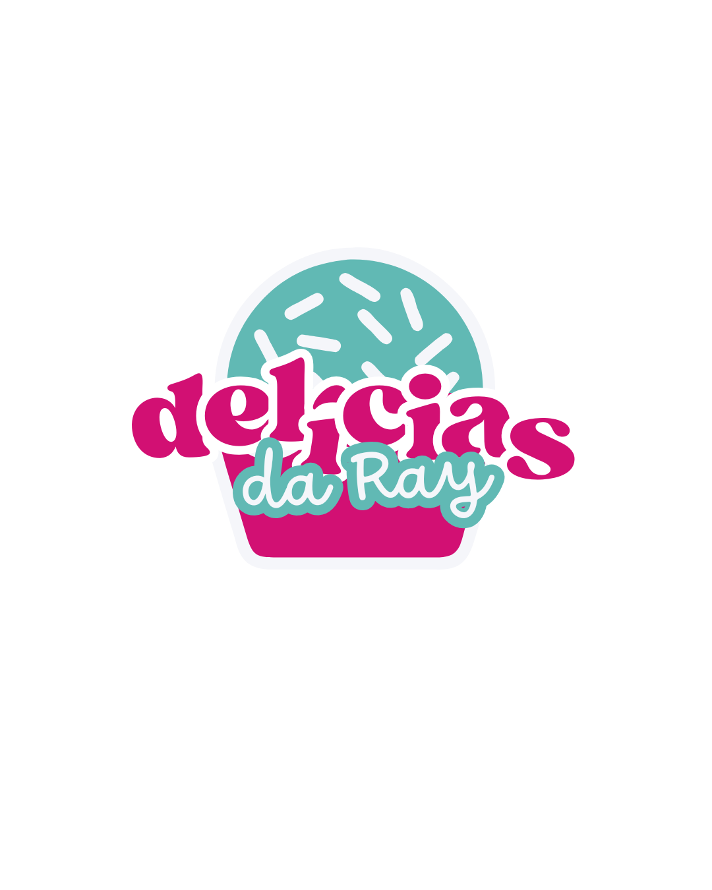

#  Delícias da Ray - Confeitaria Artesanal

Este repositório contém o código-fonte da landing page (site estático) para a Delícias da Ray, um negócio local de confeitaria artesanal focado em trufas, bolos e geladinhos gourmet.

O site está hospedado via GitHub Pages e pode ser acessado em:
**https://paulo-hdourado.github.io/delicias-da-ray**

---

##  Contexto do Projeto

Este site foi desenvolvido como um projeto acadêmico para a disciplina de Empreendedorismo e Inovação da UNITINS.

O objetivo principal não era apenas criar uma página, mas realizar uma consultoria digital para um negócio real, ajudando a empreendedora a estabelecer sua presença digital do zero.

### O Desafio
A "Delícias da Ray" possuía um produto de alta qualidade, mas uma presença digital inexistente. A divulgação era 100% "boca a boca".

### A Solução
Este site faz parte de uma reestruturação digital completa que incluiu:
Criação de uma nova Identidade Visual.
Cadastro no Google Meu Negócio.
Configuração do WhatsApp Business.
Criação desta Landing Page para centralizar o cardápio e os links de contato.

---

##  Tecnologias Utilizadas

HTML5: Para a estrutura semântica do site.
CSS3: Para toda a estilização e design responsivo (adaptável para celular).
JavaScript (JS): Para quaisquer interatividades (ex: menu mobile, galeria de fotos).
GitHub Pages: Para hospedagem gratuita e contínua.

---

## 🤝 Créditos e Colaboradores

Este projeto foi uma colaboração em equipe:

* @jupcouto - (Desenvolvimento da Estrutura Base e Design)
* @paulo-hdourado - (Revisão de Código, Adição de Conteúdo e Publicação)
